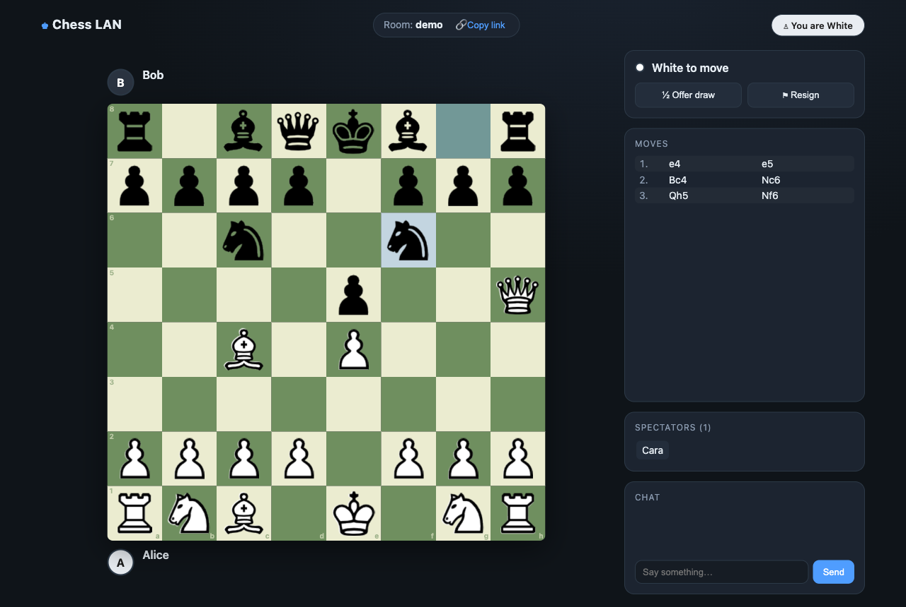
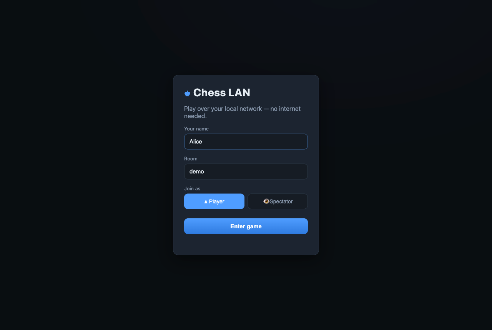
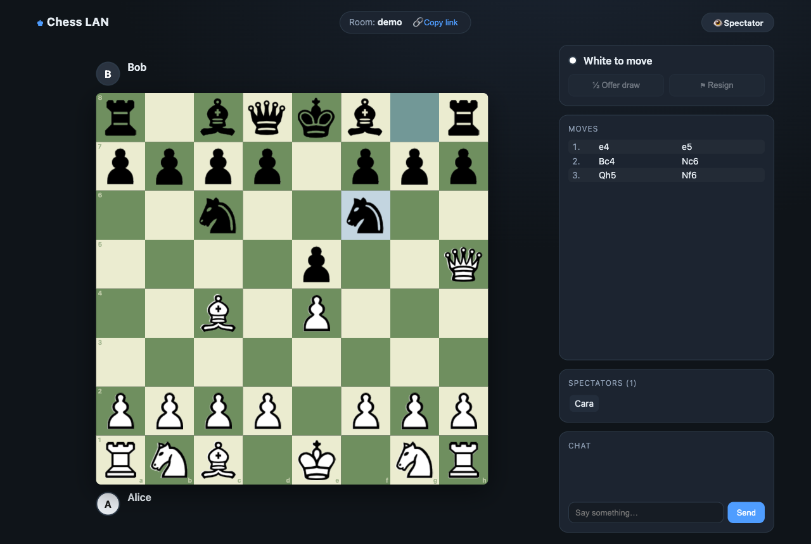
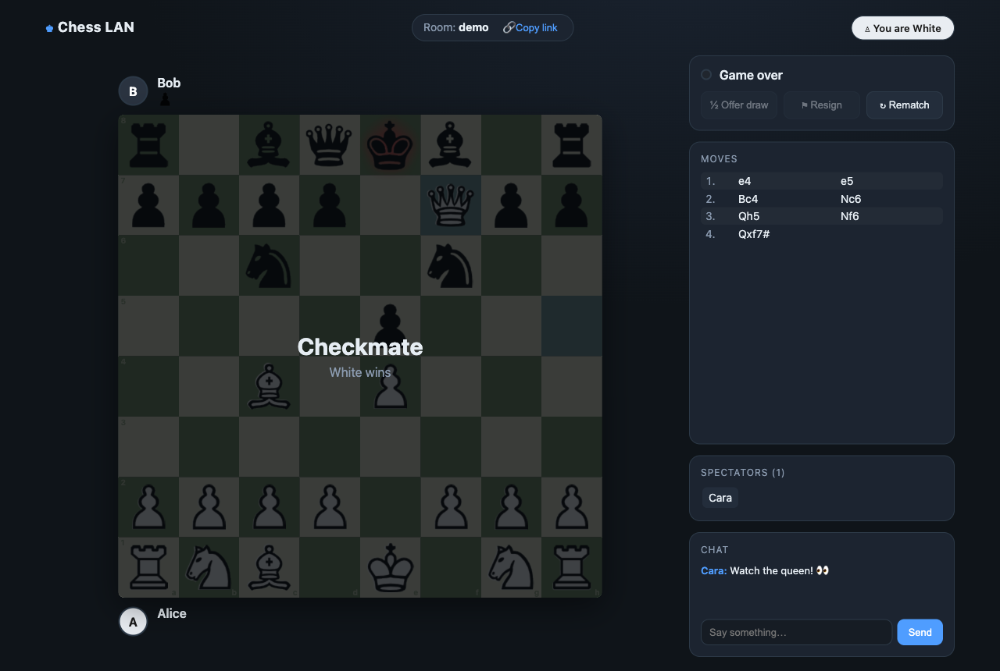

# ♚ Chess LAN

A complete, ready-to-play **multiplayer chess game you run in the browser** — designed for the
office. Start it on one machine, share the link, and anyone on the **same network can join with no
internet connection at all**. Two people play; everyone else watches live as a spectator.

Full, real chess rules (legal moves, check, checkmate, stalemate, castling, en passant, promotion,
draws) are enforced **server-side** via the battle-tested [`chess.js`](https://github.com/jhlywa/chess.js)
engine, so the game can never get into an illegal state.



---

## ✨ Features

- 🌐 **Offline LAN play** — host on one PC, others open a link. No internet, no accounts, no setup for guests.
- 🔗 **Share a link** — the server prints your LAN address on startup; there's a one-click *Copy link* button too.
- ♟️ **Real chess rules** — every legal move, plus check / checkmate / stalemate / castling / en passant / promotion / draws.
- 👁️ **Spectators** — unlimited watchers see the game update live and can chat. Empty seats can be claimed.
- 🎭 **Roles & sessions** — first two to join are White & Black; rooms let you run several games at once (`?room=name`).
- 🖱️ **Drag-and-drop or click-to-move**, legal-move highlights, last-move & check indicators, captured-piece tray, move list.
- 💬 **Built-in chat**, **resign**, **offer/agree draw**, and **rematch** (with color swap).
- 🔄 **Reconnect-safe** — refresh or drop off Wi-Fi and you keep your seat.

---

## 🚀 Quick start

> Requires **Node.js 18+** (works great on the version bundled with recent macOS/Windows installs).

```bash
# 1. Install dependencies (one-time, needs internet just for this step)
npm install

# 2. Start the server
npm start
```

You'll see something like:

```
  ♚  Chess LAN is running
  ─────────────────────────────────────────
  On this machine : http://localhost:3000
  Share on LAN    : http://192.168.0.139:3000
  ─────────────────────────────────────────
  Send a LAN link to anyone on the same Wi-Fi / network.
  First two to join play; everyone else spectates.
```

3. **Open** `http://localhost:3000` yourself, and **send the `Share on LAN` link** to anyone on the
   same Wi-Fi / LAN. They just open it in any browser — phone, laptop, whatever.

Want a different port? `PORT=8080 npm start`.

---

## 🎮 How to play

1. Enter a name, pick a **Room** (default `main`), and choose **Player** or **Spectator**.

   

2. The **first two players** are seated as White and Black. Everyone else joins as a **spectator**
   and watches the game update in real time — they can also chat and claim a seat if one is empty.

   

3. Move by **dragging** a piece or **clicking** it and then its destination. Legal targets are
   highlighted; the last move and any check are shown on the board. Reaching the back rank with a
   pawn opens a **promotion picker**.

4. The game ends on **checkmate, stalemate, draw, or resignation** — and either player can start a
   **rematch** (colors swap for fairness).

   

### Running multiple games at once

Each **room** is an independent game. Share a link like `http://<your-ip>:3000/?room=team-a` for one
match and `?room=team-b` for another. The *Copy link* button always copies your current room's link.

---

## 🧱 Project structure

```
.
├── src/
│   ├── server.js        # HTTP static server + WebSocket hub, room routing, LAN address print
│   └── room.js          # One game session: seats, spectators, server-authoritative rules
├── public/
│   ├── index.html       # Join screen + game UI
│   ├── css/style.css    # Dark, responsive theme
│   ├── js/app.js        # Client controller: networking, rendering, controls
│   ├── js/board.js      # Board view: drag/drop, click-to-move, highlights
│   └── assets/pieces/   # Piece art (reused from the original Unity project)
├── test/
│   ├── room.test.js     # Unit tests for rules & session logic (node:test)
│   └── e2e.mjs          # Headless browser test that also generates the screenshots
├── docs/screenshots/    # Images used in this README
└── legacy/              # The original Unity 2018 prototype, kept for posterity
```

> **Architecture in one line:** the browser renders and offers a responsive UI (it bundles
> `chess.js` for instant legal-move hints), but **the server validates and applies every move**, then
> broadcasts an authoritative snapshot to all players and spectators in the room.

---

## ✅ Testing

```bash
# Unit tests — rules, seating, checkmate, castling, promotion, draws, rematch…
npm test

# End-to-end browser test (self-contained: boots its own server).
# Drives two players + a spectator, plays a full game to checkmate,
# and regenerates the screenshots in docs/screenshots/.
npm run test:e2e
```

The unit suite covers role assignment, illegal-move rejection, Fool's-mate checkmate detection,
castling, promotion choice, resignation, mutual draw agreement, rematch color-swap, and spectators
sitting down. The e2e test verifies live multiplayer sync, the spectator view, chat, and a full
Scholar's-Mate ending in checkmate.

---

## 🗂️ About the `legacy/` folder

This repository began as a Unity 2018 prototype (a board scene with a drag-and-drop script and an
empty rules class). That original project is preserved under `legacy/` for reference. Its lovely
piece artwork lives on — it's reused as the board pieces in this web app. The playable game is the
Node + browser app described above.

---

## 🛠️ Tech

- **Node.js** + **Express** (static file serving)
- **ws** (WebSocket real-time multiplayer)
- **chess.js** (authoritative rules engine, shared by server and client)
- Vanilla HTML/CSS/JS client — no build step, fully offline once `npm install` has run

## 📄 License

MIT
